# VaporDrop — 零知識暫存傳送門

> 為「人 → VM / AI Agent」之間安全遞送文字與檔案而設的極簡 webapp。
> 內容 10 分鐘自動蒸發、伺服器只見密文、不留日誌、30 分鐘閒置自動登出。

---

## 1. 設計目標與非目標

### 1.1 目標（Must have）

| # | 目標 | 具體要求 |
|---|------|----------|
| G1 | 安全且方便的登入 | Passkey / WebAuthn，一次註冊，之後 Touch ID 一觸即入；無密碼、無郵件、抗釣魚 |
| G2 | Session 化暫存 | 登入後可開新 session，貼文字或上傳檔案，內容集中於該 session |
| G3 | 10 分鐘蒸發 | 每個 content session TTL = 600 秒，到期自動且不可回復地刪除 |
| G4 | 不留日誌、不可追蹤 | 無 access log、不記 IP/UA、無 analytics、無持久化儲存 |
| G5 | 30 分鐘自動登出 | 滑動式 idle timeout，可即時撤銷 |
| G6 | Agent 友好 | 一條 `curl` 即可取內容，適合 VM / AI Agent 消費 |

### 1.2 非目標（Out of scope）

- 不做多用戶協作、不做版本控制、不做長期檔案儲存。
- 不做防「合法接收方自行複製內容」——DRM 不在威脅模型內。
- 不做匿名公開分享服務（僅限已認證用戶開 session）。

---

## 2. 系統架構

### 2.1 元件架構圖

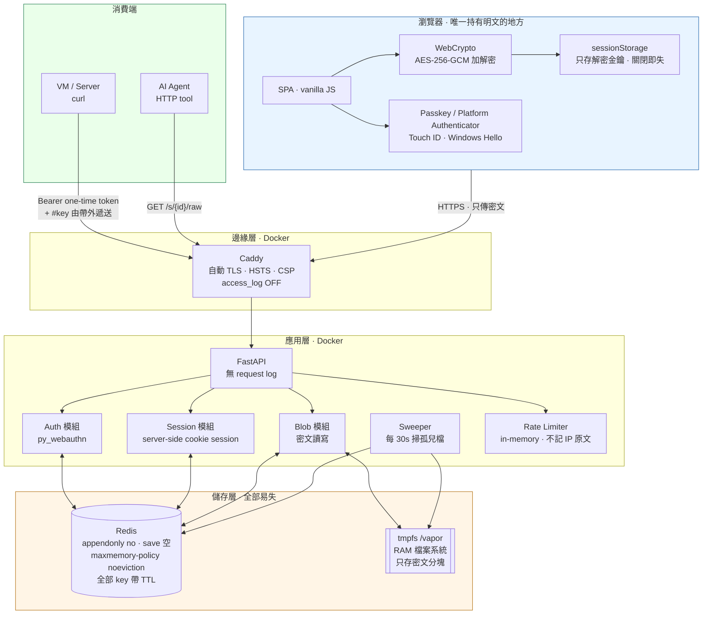

### 2.2 信任邊界與資料形態

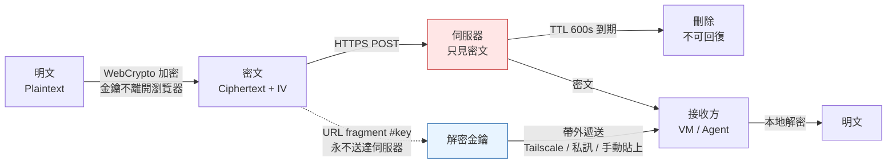

> **核心保證**：伺服器被完全入侵、磁碟被扣押、或被第三方要求交出資料時，能交出的只有 600 秒內的密文；金鑰從未存在於伺服器記憶體或日誌中。

---

## 3. 核心流程

### 3.1 Passkey 註冊（一次性，需 Bootstrap Token）

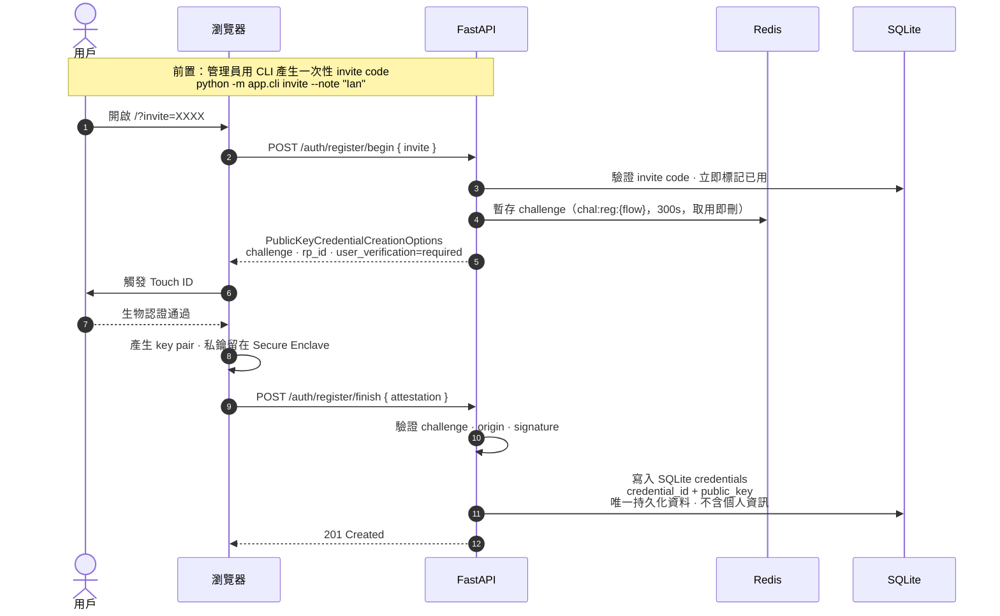

### 3.2 登入（Passkey Assertion）

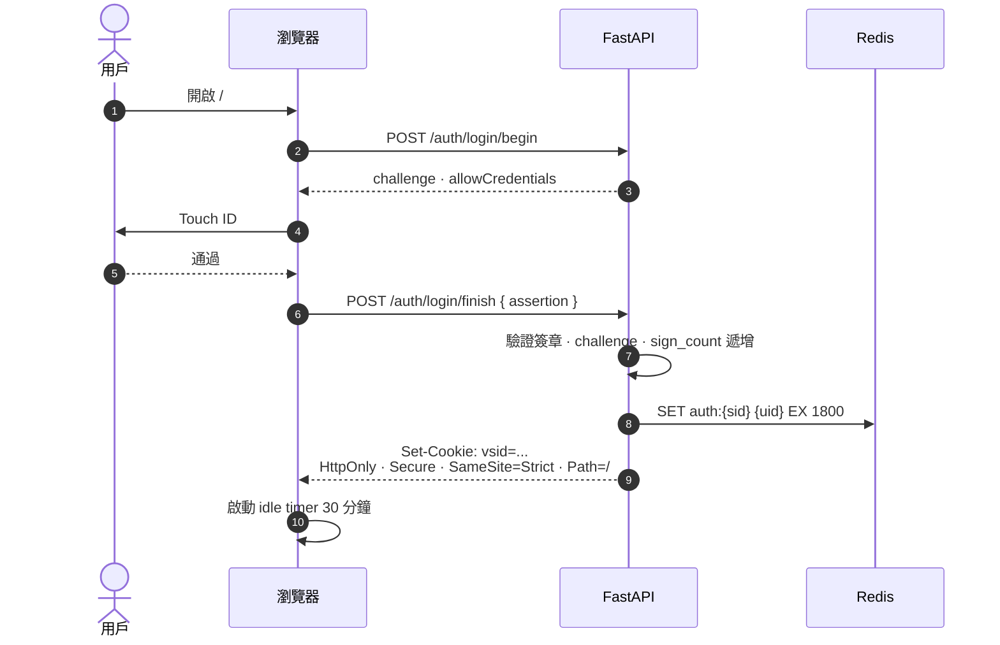

### 3.3 開 Session 並上傳（零知識）

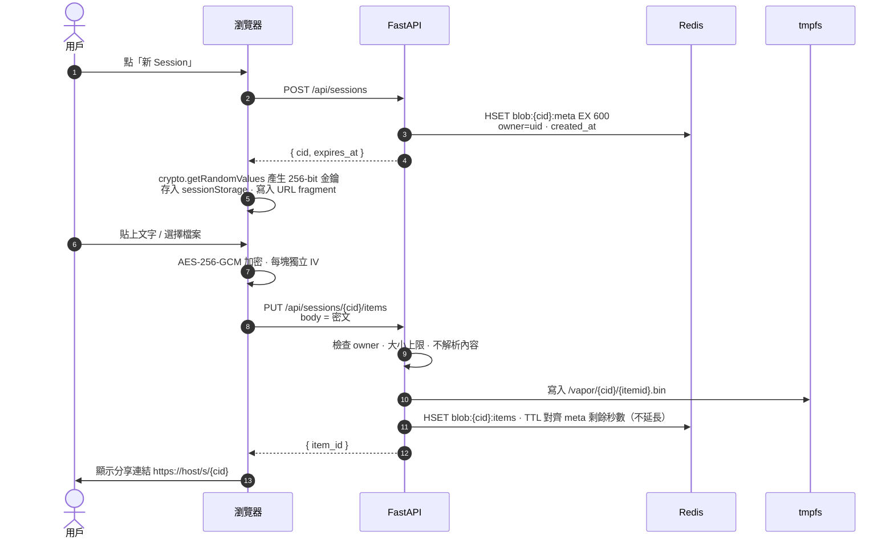

### 3.4 Agent / VM 取用

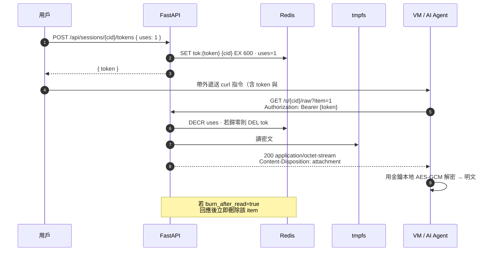

> **給 Agent 的極簡模式**：若接收方在同一 Tailscale tailnet 內（傳輸已加密且已認證），可用 `?mode=plain` 開關由伺服器端持有金鑰、直接回純文字，換取「一條 curl 搞定」的便利。此模式犧牲零知識性質，**預設關閉**，需在設定中明確啟用。

### 3.5 Session 生命週期狀態機

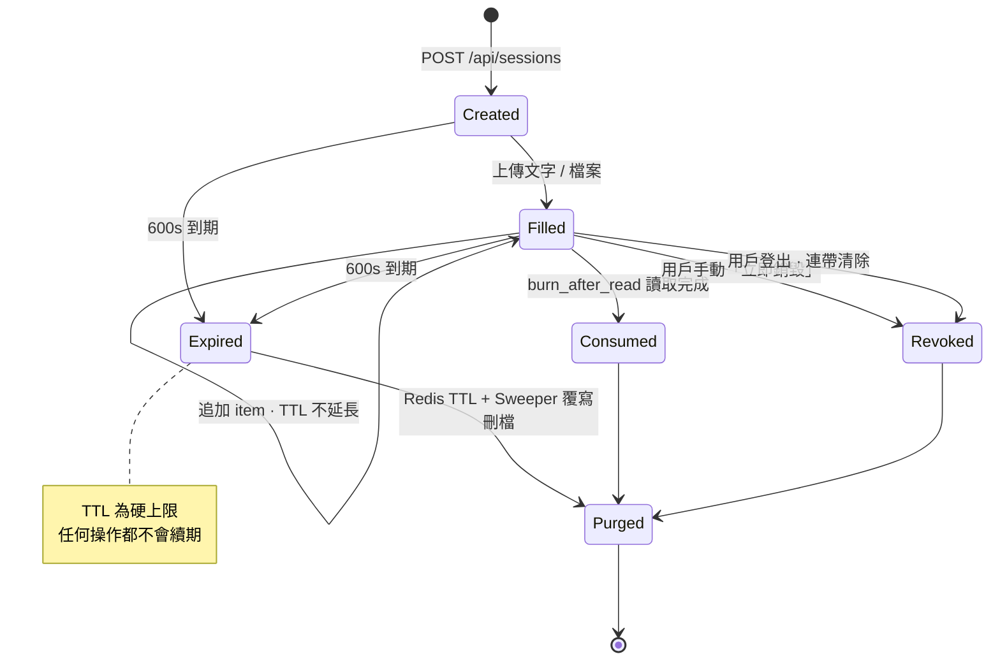

### 3.6 登出與閒置逾時

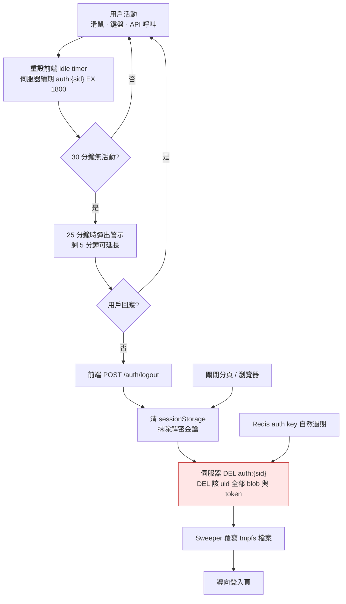

---

## 4. 功能清單

### 4.1 用戶功能

| 功能 | 說明 |
|------|------|
| Passkey 登入 / 註冊 | 一次註冊，多裝置可各自註冊；支援多把 credential |
| 新建 Session | 一鍵開 session，顯示 10 分鐘倒數 |
| 貼文字 | 大段文字直接貼上，自動加密；支援語法無關的純文字 |
| 上傳檔案 | 多檔上傳、分塊加密；單檔上限與 session 總量上限可設 |
| 分享連結 | `https://host/s/{cid}#k=...`，金鑰在 fragment |
| 一次性 Token | 產生 N 次可用的 Bearer token，供 VM / Agent 使用 |
| Burn after read | 可選：被讀一次即銷毀 |
| curl 指令一鍵複製 | 直接產生可貼到 VM 的完整指令 |
| 立即銷毀 | 不等 TTL，手動清空 session |
| 手動登出 | 即時撤銷 session 與所有未過期內容 |

### 4.2 系統功能

| 功能 | 說明 |
|------|------|
| TTL 強制 | Redis 原生 TTL，任何操作不續期 content session |
| Sweeper | 每 30 秒對照 Redis 與 tmpfs，清孤兒檔（先覆寫再 unlink） |
| 無日誌模式 | Caddy `access_log off`、Uvicorn `--no-access-log`、app 層不記錄任何識別資訊 |
| 無身份 Metrics | 僅暴露 `active_sessions`、`bytes_in_ram`、`sweeper_last_run` |
| Rate Limit | in-memory token bucket，key 為 `HMAC(ip, 每日輪換 salt)`，不存 IP 原文 |
| 重啟即全清 | 無持久化，容器重啟後除 Passkey 憑證外一切歸零 |

### 4.3 API 表

| Method | Path | 認證 | 說明 |
|--------|------|------|------|
| POST | `/auth/register/begin` \| `/finish` | invite code | Passkey 註冊 |
| POST | `/auth/login/begin` \| `/finish` | — | Passkey 登入 |
| POST | `/auth/logout` | cookie | 登出並清除全部內容 |
| POST | `/api/sessions` | cookie | 開新 content session |
| PUT | `/api/sessions/{cid}/items` | cookie | 上傳密文 item |
| GET | `/api/sessions` | cookie | 列出自己未過期的 session |
| DELETE | `/api/sessions/{cid}` | cookie | 立即銷毀 |
| POST | `/api/sessions/{cid}/tokens` | cookie | 產生一次性 Bearer token |
| GET | `/s/{cid}` | token 或 cookie | 接收方 UI（自 fragment 取金鑰解密） |
| GET | `/s/{cid}/raw` | Bearer token | 回密文（或 plain 模式回明文），供 curl |
| GET | `/healthz` \| `/metrics` | 內網 | 無身份健康與計數 |

---

## 5. 安全管理

### 5.1 威脅模型

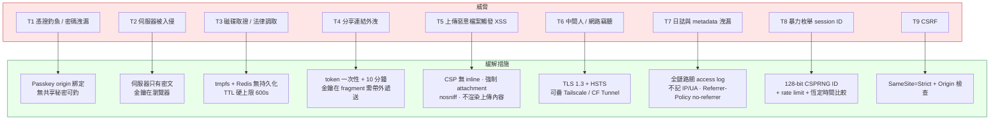

### 5.2 控制矩陣

| 層面 | 控制 | 實作要點 |
|------|------|----------|
| 身份 | Passkey，`user_verification=required` | 驗 `origin`、`rp_id`、challenge 一次性、`sign_count` 遞增 |
| 準入 | 註冊需一次性 invite code | CLI 產生、15 分鐘 TTL、用後即毀 |
| 會話 | Server-side session + 不可猜 cookie | `HttpOnly` `Secure` `SameSite=Strict`，不用 JWT 以保即時撤銷 |
| 授權 | 每次操作驗 owner | `blob:{cid}:meta.owner == 當前 uid`；token 只綁單一 cid |
| 機密性 | 端到端 AES-256-GCM | 每 item 獨立 IV；金鑰 256-bit CSPRNG；只放 URL fragment |
| 完整性 | GCM 認證標籤 | 密文被篡改則解密失敗，不會回傳半殘資料 |
| 存留期 | Redis TTL 600s + Sweeper | 不續期；刪除前先以隨機資料覆寫 |
| 傳輸 | TLS 1.3、HSTS preload | 建議再置於 Tailscale tailnet 或 Cloudflare Tunnel 後 |
| 瀏覽器 | 嚴格 Header | `CSP: default-src 'self'; script-src 'self'; object-src 'none'; frame-ancestors 'none'`、`X-Content-Type-Options: nosniff`、`Referrer-Policy: no-referrer`、`Permissions-Policy` 全關 |
| 可觀測性 | 無日誌 | Caddy `access_log off`；Uvicorn `--no-access-log`；例外只記錯誤類型不記載荷 |
| 濫用防護 | 速率限制與配額 | 每帳號同時 session 上限、單檔上限、總 RAM 上限；超限拒絕而非落磁碟 |
| 供應鏈 | 零 CDN、鎖版本 | 前端無外部 script；`requirements.txt` 釘 hash；容器 `--read-only`、non-root、`no-new-privileges` |

### 5.3 已知殘留風險（誠實揭露）

1. **Metadata 仍存在**：伺服器知道「某帳號在某時刻開了 session、密文多大」。若連此都要隱藏，需在 tailnet 內部署並關閉外部入口。
2. **金鑰遞送靠帶外通道**：若你把含 `#k=` 的完整連結貼進不安全的聊天工具，零知識即失效。建議連結與金鑰分開遞送，或全程只在 tailnet 內操作。
3. **接收端明文落地**：Agent 解密後如何處理明文，超出本系統控制；建議 Agent 端也寫入 tmpfs 並用完即刪。
4. **無日誌 = 無取證**：出事時你也查不到誰做了什麼。這是刻意的取捨，請確認符合你的合規要求（HK PDPO 下屬「資料最小化」友好，但若需審計軌跡則需另議）。
5. **瀏覽器記憶體**：明文與金鑰在頁面存活期間留在記憶體；建議用完即關分頁。

---

## 6. 實際用例與場景

### 6.1 場景一：把大段 prompt / 程式碼餵給隔離 VM 的 Agent

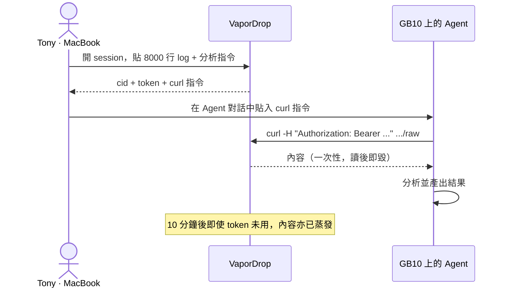

**價值**：避免把大段內容貼進第三方聊天窗（會被記錄），也避免用 pastebin（永久公開）。

### 6.2 場景二：跨 VM 遞送設定檔而不落地 Git

工作站產生一份含端點與參數的 `config.yaml`，需送到三台 Ubuntu VM。開一個 session、`uses: 3` 的 token，三台各 `curl` 一次，10 分鐘後自動消失——不進 Git、不進 S3、不留在 `~/.bash_history` 以外任何地方。

### 6.3 場景三：與外部顧問一次性交換敏感文件

法律或客戶文件不宜進 email 附件（永久留存於雙方 mailbox）。開 session、`burn_after_read=true`，連結經一個通道、金鑰經另一通道遞送。對方讀取後即銷毀，你也能確認「已被讀取」。

### 6.4 場景四：多 Agent 之間的短命共享暫存區

編排流程中 Agent A 產出中間結果、Agent B 消費。以 VaporDrop 作為「不留痕的 blackboard」：A `PUT`、B `GET`，10 分鐘窗口內完成交接，不需為此開資料庫或物件儲存。

### 6.5 場景五：示範與教學環境

給客戶做 POC 時要臨時遞送 demo 資料集。session 自動過期，示範完不需人工清理，不會有「上次示範資料還留在伺服器上」的合規尷尬。

---

## 7. 部署藍圖

### 7.1 容器拓撲

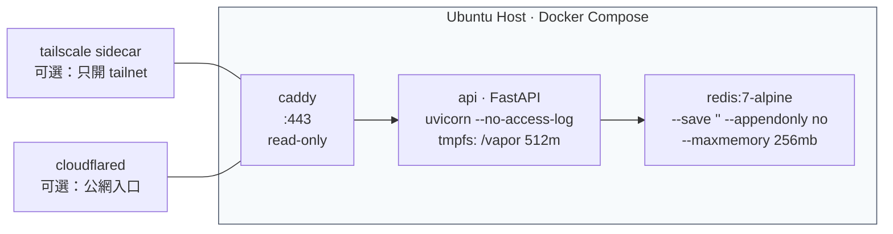

### 7.2 關鍵設定（節錄）

```yaml
# docker-compose.yml 要點
services:
  redis:
    command: >
      redis-server --save "" --appendonly no
      --maxmemory 256mb --maxmemory-policy noeviction
    tmpfs: [/data]
  api:
    read_only: true
    tmpfs:
      - /vapor:size=512m,mode=1700,noexec,nosuid,nodev
      - /tmp:size=32m
    security_opt: [no-new-privileges:true]
    user: "10001:10001"
    environment:
      CONTENT_TTL_SECONDS: 600
      IDLE_TIMEOUT_SECONDS: 1800
      MAX_ITEM_BYTES: 33554432        # 32 MB
      MAX_SESSION_BYTES: 134217728    # 128 MB
      MAX_ACTIVE_SESSIONS_PER_USER: 5
      ALLOW_SERVER_SIDE_PLAIN: "false"
      RP_ID: vapor.example.com
```

### 7.3 資料分層與 Key 設計

完整版（含每個欄位、TTL 規則、密碼學細節）見 **[docs/DATA_MODEL.md](docs/DATA_MODEL.md)**。摘要：

**持久層 — SQLite `/data/vapor.db`（唯一需要備份的東西）**

| 表 | 內容 |
|----|------|
| `users` | `uid`、`handle`、`created_at`、`disabled` |
| `credentials` | Passkey 公鑰、`sign_count`、`transports`、`label`、`last_used_at` |
| `invites` | 一次性註冊碼、`expires_at`、`used_at`、`used_by` |

**揮發層 — Redis（`--save "" --appendonly no`，每個 key 都必須有 TTL）**

| Key | 型別 | TTL | 內容 |
|-----|------|-----|------|
| `auth:{sid}` | hash | 1800s（滑動） | `uid`、`created_at`、`last_seen` |
| `chal:reg\|auth:{flow}` | string | 300s | WebAuthn challenge，取用即刪 |
| `blob:{cid}:meta` | hash | 600s（**永不續期**） | `owner`、`label`(密文)、`expires_at`、`bytes`、`burn`、`plain` |
| `blob:{cid}:items` | hash | 對齊 meta 剩餘 | `iid` → JSON（`name` 密文、`kind`、`size`） |
| `tok:{token}` | hash | `min(內容剩餘, 請求值)` | `cid`、`uses`（`HINCRBY` 原子扣減） |
| `user:{uid}:blobs` | set | 2400s | 該用戶的 cid 集合 |

**揮發層 — tmpfs `/vapor/{cid}/{iid}.bin`**：`iv(12B) ‖ ciphertext‖tag`，刪除時隨機覆寫 + fsync 再 unlink。

速率限制桶在程序內記憶體，key 是 `HMAC(每日輪換 salt, IP)`，**不存 IP 原文**。

刻意不存在：`sessions`、`contents`、`access_log`、`audit_trail`、`shares`。

### 7.4 專案結構

```
VaporDrop/
├── README.md                  本文件：完整方案與架構
├── schema.sql                 SQLite schema（含「刻意不建的表」註記）
├── Dockerfile                 python:3.12-slim，uid 10001，唯讀根檔案系統
├── docker-compose.yml          redis（零持久化）+ api（read_only）+ caddy（無日誌）
├── Caddyfile                  TLS、request_body 上限、log discard
├── .env.example               所有可調參數（附中文說明）
├── Makefile                   up / down / test / dev / invite / verify / nuke
├── app/
│   ├── main.py                FastAPI 入口、lifespan、sweeper、/healthz、/metrics
│   ├── config.py              環境變數與預設值
│   ├── db.py                  SQLite（Passkey 憑證、邀請碼）
│   ├── store.py               Redis + tmpfs：TTL 不變量、覆寫抹除、sweeper
│   ├── security.py            安全標頭、速率限制、session cookie、same-origin
│   ├── auth_routes.py         WebAuthn 註冊 / 登入 / 裝置管理 / 登出
│   ├── session_routes.py      內容 session CRUD、token、/s/{cid}/raw
│   ├── cli.py                 invite / users / disable / purge
│   └── static/                index.html、receive.html、css、js（vcrypto/webauthn/api/app/receive）
├── scripts/
│   ├── vapor_fetch.py         接收端 CLI（僅需 python3 + cryptography）
│   └── verify.sh              部署後 15 項自動驗收
├── tools/devserver.py         本機開發用（fakeredis，免 Docker）
├── tests/test_lifecycle.py    13 項安全與生命週期測試
└── docs/
    ├── DEPLOY.md              部署步驟（寫給部署的人或 AI Agent）
    ├── DATA_MODEL.md          資料模型與密碼學細節
    └── SECURITY.md            威脅模型、控制項、驗收清單
```

### 7.5 API

| 方法 | 路徑 | 說明 |
|------|------|------|
| GET | `/auth/state` | 是否已登入、是否可 bootstrap |
| POST | `/auth/register/begin` `/finish` | Passkey 註冊（需邀請碼，首位用戶例外） |
| POST | `/auth/login/begin` `/finish` | 免輸入帳號的 discoverable 登入 |
| GET/DELETE | `/auth/credentials` | 列出 / 移除 Passkey 裝置 |
| POST | `/auth/logout` | 登出並清空該用戶所有內容 |
| POST/GET | `/api/sessions` | 開新 session / 列出自己的 session |
| PUT | `/api/sessions/{cid}/items` | 上傳密文（`X-Vapor-Name`、`X-Vapor-Kind`） |
| DELETE | `/api/sessions/{cid}` | 立即銷毀 |
| POST | `/api/sessions/{cid}/tokens` | 產生限次取用 token |
| GET | `/api/receive/{cid}` | 接收端取 manifest（不消耗次數） |
| GET | `/s/{cid}/raw` | 取密文（消耗次數，強制 attachment） |
| GET | `/healthz` `/metrics` | 健康檢查、兩個聚合數字 |

### 7.6 快速開始

```bash
git clone https://github.com/tonylnng/VaporDrop.git && cd VaporDrop
cp .env.example .env          # 至少改 SITE_ADDRESS / RP_ID / ORIGINS
make up                       # docker compose up -d --build
# 開 https://your-domain → 展開「第一次使用」→ 註冊第一個 Passkey
make verify URL=https://your-domain
```

之後把 `ALLOW_FIRST_USER_BOOTSTRAP` 改為 `false`，用 `make invite` 邀請其他人。
完整步驟（含 Tailscale / Cloudflare Tunnel 變體）見 **[docs/DEPLOY.md](docs/DEPLOY.md)**。

接收端（VM / AI Agent）：

```bash
export VAPOR_URL="https://your-domain/s/<cid>"
export VAPOR_TOKEN="<t>"   # 來自分享連結 fragment
export VAPOR_KEY="<k>"
python3 scripts/vapor_fetch.py --all -o ./inbox
```

## 8. 驗收清單

- [ ] 上傳後查 Redis 與 tmpfs：只見密文，無明文片段。
- [ ] 601 秒後 `GET /s/{cid}/raw` 回 404，且 tmpfs 內無殘檔。
- [ ] Caddy 與 app 容器 `docker logs` 中無任何 URL、IP、UA。
- [ ] 一次性 token 第二次使用回 404（不洩漏存在性）。
- [ ] 上傳 `evil.html` 後訪問，瀏覽器下載而非渲染。
- [ ] 31 分鐘閒置後任何 API 回 401，且該用戶所有 session 已清空。
- [ ] `python -m pytest tests -q` 全數通過（13 項）。
- [ ] `./scripts/verify.sh https://your-domain` 15 項全過。
- [ ] 從另一帳號嘗試存取他人 `cid` 回 404（非 403，避免存在性洩漏）。
- [ ] 容器重啟後：Passkey 仍可登入，內容全數消失。
- [ ] 移除 `#k=` 後開啟連結：頁面明確提示缺少金鑰，無法解密。

---

## 9. 現況與待你決定的事

**現況**：程式碼、資料庫 schema、Docker 編排、接收端 CLI、驗收腳本與 13 項測試皆已完成並通過；瀏覽器端到端流程（虛擬 Passkey 註冊 → 加密上傳 → 一次性 token → 接收頁與 CLI 解密）已實測成功，伺服器端 blob 確認為密文。

**仍需你決定**：

1. **入口方式**：純 Tailscale tailnet（隱私最高）／ Cloudflare Tunnel ／ 直接公網 + Let's Encrypt。三種都已寫在 [docs/DEPLOY.md](docs/DEPLOY.md)，只差選一個。
2. **是否啟用 `ALLOW_SERVER_SIDE_PLAIN`**：開了接收端一條 `curl` 就能拿明文，代價是伺服器看得見內容。預設關。
3. **檔案上限**：單檔 32 MB、單 session 128 MB（tmpfs 佔 RAM，調大請同步調 `MAX_BODY_SIZE` 與 tmpfs size）。
4. **repo 可見性**：目前為 public。安全性不依賴程式碼保密，但若不想公開部署細節，建議改 private。
