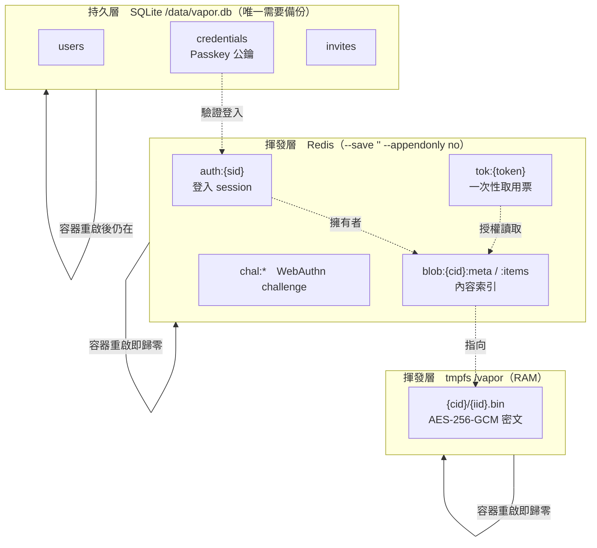
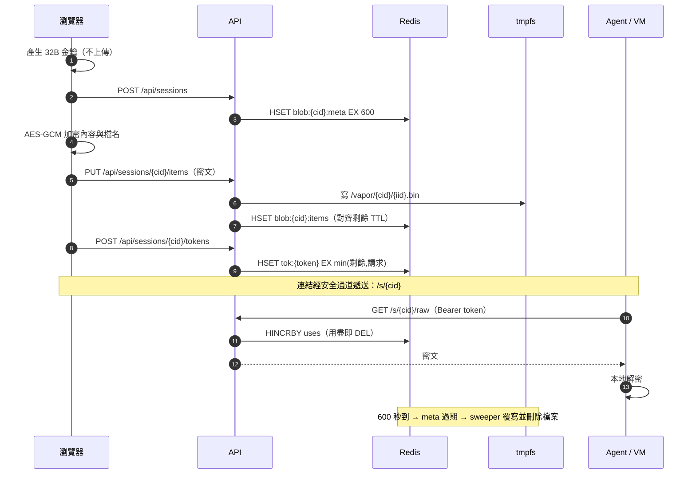

# 資料模型

VaporDrop 的資料刻意分成三層，界線是「這份資料消失了會不會很麻煩」：



重點：**內容一律沒有備份，重啟即消失。** 這是需求，不是缺陷。

---

## 1. 持久層：SQLite

檔案 `/data/vapor.db`（compose volume `vapor-db`）。完整定義見 [`schema.sql`](../schema.sql)。

| 表 | 欄位 | 用途 |
|----|------|------|
| `users` | `uid` PK、`handle` UNIQUE、`created_at`、`disabled` | 帳號。`handle` 只用於顯示與 Passkey 註冊，不含 email/電話 |
| `credentials` | `credential_id` PK、`uid`、`public_key` BLOB、`sign_count`、`transports`、`label`、`created_at`、`last_used_at` | WebAuthn 公鑰。私鑰永遠在使用者裝置的安全元件內，伺服器拿不到 |
| `invites` | `code` PK、`created_at`、`expires_at`、`used_at`、`used_by`、`note` | 一次性註冊邀請，預設 15 分鐘過期 |

**故意不存在的表**（schema.sql 內有註記，避免日後有人「順手補上」）：

- `sessions` — 登入狀態只在 Redis，重啟即失效
- `contents` / `items` — 內容索引只在 Redis
- `access_log` / `audit_trail` — 不記錄誰在何時取用了什麼
- `shares` — 分享連結不落地，token 只在 Redis

`last_used_at` 是唯一帶時間痕跡的欄位，精度到秒、只覆寫不累積，用途是讓你發現「某把不該再用的 Passkey 還在被用」。若連這個都不想要，把 `db.touch_credential` 改成 no-op 即可。

---

## 2. 揮發層：Redis

`decode_responses=True`，單一 db。**不變量：每一個 key 建立時都必須設 TTL。** 測試 `test_all_keys_have_ttl` 會掃全庫驗證這件事。

| Key | 型別 | 欄位 / 內容 | TTL | 說明 |
|-----|------|-------------|-----|------|
| `auth:{sid}` | hash | `uid`、`created_at`、`last_seen` | `IDLE_TIMEOUT`（1800s，每次請求滑動續期） | 登入 session。cookie 只帶 `sid` |
| `chal:reg:{flow}` / `chal:auth:{flow}` | string | WebAuthn challenge（含待註冊 handle / invite） | `FLOW_TTL`（300s） | 取用即刪（`flow_take` = GET+DEL），防重放 |
| `blob:{cid}:meta` | hash | `owner`、`label`（密文）、`created_at`、`expires_at`、`bytes`、`burn`、`plain` | `CONTENT_TTL`（600s，**永不續期**） | session 中介資料 |
| `blob:{cid}:items` | hash | `iid` → JSON（`name` 密文、`kind`、`size`、`created_at`） | 對齊 meta 的剩餘 TTL | 項目索引 |
| `tok:{token}` | hash | `cid`、`uses` | `min(剩餘內容 TTL, 請求值)` | 一次性/限次取用票，`token_spend` 以 `HINCRBY` 原子扣減 |
| `user:{uid}:blobs` | set | `cid` 集合 | `IDLE_TIMEOUT + CONTENT_TTL` | 供列表與登出清空使用；成員可能已過期，讀取時會過濾 |

速率限制**不進 Redis**：它是 `app/security.py` 內的程序內記憶體字典，桶的 key 是 `HMAC(每日輪換 salt, client_host)` 截斷 16 字元。IP 原文從不落地、不進 Redis、不進日誌，重啟即歸零。

TTL 的兩條硬規則：

1. `blob:*` 的 TTL 只會變短，不會變長。加入新項目時 `items` 的 expiry 是對齊 `meta` 的剩餘秒數算出來的，所以「上傳續命」不可能發生。
2. token 的 TTL 不會超過內容剩餘時間。連結不可能比內容活得久。

---

## 3. 揮發層：tmpfs

```
/vapor/{cid}/{iid}.bin      ← iv(12 bytes) || ciphertext+GCM tag
```

- `/vapor` 掛成 `tmpfs size=512m,mode=0700,uid=10001,noexec,nosuid,nodev` —— 內容從不觸碰磁碟，也不可能被當成可執行檔跑起來。
- `cid` / `iid` 都是伺服器產生的 base64url 隨機字串；`_item_path()` 會拒絕任何含 `/`、`.` 的值（路徑穿越防護，測試 `test_path_traversal_rejected` 覆蓋）。
- 刪除採「覆寫再 unlink」：`_shred_file()` 先以隨機位元組覆蓋原長度、`fsync`，再 `os.unlink`。tmpfs 本來就在 RAM，這一步是防禦 swap 殘留。
- 清理有三個獨立路徑，任一個失效都還有備援：
  1. 使用者按「立即銷毀」或 `DELETE /api/sessions/{cid}`
  2. 登出 → 清該用戶所有內容
  3. 背景 sweeper（每 `SWEEP_INTERVAL` 30s，冷啟動也跑一次）→ 掃 `/vapor` 目錄，凡 Redis 內已無對應 `meta` 的即視為孤兒並抹除

第 3 條是關鍵：即使 Redis key 因 TTL 自然過期而沒人通知檔案層，密文最多多活 30 秒。

---

## 4. 密碼學細節

| 項目 | 值 |
|------|-----|
| 演算法 | AES-256-GCM（WebCrypto `crypto.subtle`） |
| 金鑰 | 32 bytes，`crypto.getRandomValues`，**每個 session 一把**，只存在瀏覽器 |
| IV | 12 bytes，每個項目獨立隨機 |
| 線上格式 | `iv ‖ ciphertext‖tag` |
| 金鑰傳遞 | 只在分享連結的 fragment：`/s/{cid}#k=<key>&t=<token>`。fragment 不會出現在 HTTP request，因此不會進伺服器、不進 proxy、不進 referrer |
| 檔名 / 標籤 | 另外獨立加密，經 `X-Vapor-Name` 標頭上傳；伺服器只看到密文 |
| 瀏覽器暫存 | `sessionStorage["vk:<cid>"]`，`pagehide` 時清除 |

伺服器端能看見的中介資料只有：擁有者 uid、項目數、位元組數、`kind`（text/file）、時間戳。看不到內容、檔名、標籤。

---

## 5. 一份內容的生命線


