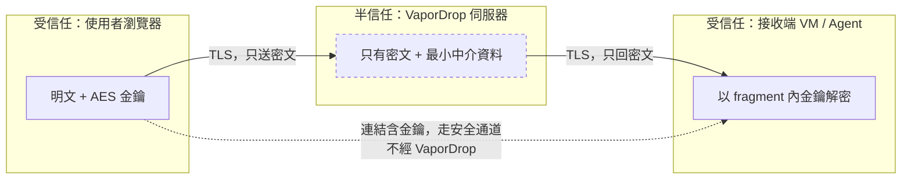

# 安全模型

## 1. 我們防什麼、不防什麼

| 威脅 | 是否防護 | 做法 |
|------|----------|------|
| 陌生人在網路上找到並使用這個服務 | ✅ | Passkey 才能登入；邀請碼才能註冊；`noindex`；可再套 tailnet / Cloudflare Access |
| 密碼被猜、被撞庫、被釣魚 | ✅ | 完全沒有密碼。WebAuthn 綁定 origin，釣魚站無法重用 |
| 伺服器被入侵後翻出歷史內容 | ✅ | 內容 10 分鐘即抹除、只在 RAM、只有密文、無日誌、無備份 |
| 硬碟被抄走 / VPS 快照 | ✅ | 內容從不寫磁碟；持久卷只有 Passkey 公鑰與邀請碼 |
| 網路中間人看到內容 | ✅ | TLS + 應用層 AES-256-GCM（伺服器也看不到明文） |
| 其他登入用戶偷看我的 session | ✅ | 所有讀寫檢查 owner；跨用戶一律回 404 |
| 分享連結被轉貼後被反覆下載 | ✅ | token 限次（預設 1 次）＋不長於內容 TTL；可開「讀後即毀」 |
| 事後被追問「誰在何時拿了什麼」 | ✅（設計如此） | 沒有 access log、沒有審計表，答案是「查不到」 |
| 收到連結的人自己把明文存下來 | ❌ | 技術上不可能防。這是信任決定 |
| 拿到連結的任何人（含被轉發者） | ❌ | 連結即憑證。請只用安全通道遞送 |
| 惡意瀏覽器擴充 / 被入侵的端點 | ❌ | 明文在瀏覽器內必然存在 |
| 流量分析（誰在何時上傳了多大的東西） | ⚠️ 部分 | 大小與時間對 proxy/網路觀察者可見 |
| 記憶體取證（RAM dump / swap） | ⚠️ 部分 | tmpfs 在 RAM；已做覆寫抹除，但建議主機關 swap 或全盤加密 |

---

## 2. 信任邊界

金鑰與 token 只出現在 URL fragment（`#k=…&t=…`）。fragment 依 HTTP 規範不會送往伺服器，所以不進 access log、不進 proxy、不進 Referer。

---

## 3. 已實作的控制項

**身份**
- WebAuthn/FIDO2，`require_user_verification=True`（必須指紋/臉/PIN）
- discoverable credential → 無需輸入帳號即可登入
- `sign_count` 單調遞增檢查（偵測憑證克隆）
- challenge 一次性：`flow_take()` 是 GET+DEL 原子操作
- 註冊需邀請碼；首次部署的 bootstrap 例外可用 `ALLOW_FIRST_USER_BOOTSTRAP=false` 關閉

**Session**
- cookie `HttpOnly; Secure; SameSite=Strict`，內容只有隨機 sid
- 30 分鐘無活動即失效（Redis TTL 滑動續期，前端另有 5 分鐘前警告）
- 登出 = 刪 session ＋ **清掉該用戶所有內容**
- 所有寫入端點檢查 same-origin

**內容**
- 瀏覽器端 AES-256-GCM，每 session 一把獨立金鑰
- 檔名/標籤另外加密，走 `X-Vapor-Name` 標頭
- 10 分鐘 TTL，**任何操作都不會延長**
- 三重清理：手動銷毀 / 登出清空 / 背景 sweeper 掃孤兒（30s）
- 刪除時隨機覆寫 + fsync 再 unlink
- 配額：單項 32 MB、單 session 128 MB、50 項、同時 5 個 session

**傳輸與取用**
- token 以 `HINCRBY` 原子扣減，用盡即刪；TTL 不超過內容剩餘時間
- `/s/{cid}/raw` 強制 `Content-Disposition: attachment`（避免內容在瀏覽器被當 HTML 執行）
- 不存在或不屬於你的資源一律 404，不用 403（不洩漏存在性）

**平台**
- CSP `script-src 'self'`，無任何 inline script
- `X-Frame-Options: DENY`、`nosniff`、`Referrer-Policy: no-referrer`、COOP/CORP、`Permissions-Policy` 全關、`Cache-Control: no-store`、`X-Robots-Tag: noindex`
- 移除 `Server` 標頭；`/docs`、`/redoc`、`/openapi.json` 全部 404
- 容器 `read_only`、`cap_drop: ALL`、`no-new-privileges`、uid 10001 非 root
- tmpfs `noexec,nosuid,nodev`
- Redis `--save "" --appendonly no`（零持久化）、`noeviction`（寧可拒寫也不靜默丟資料）
- Caddy 與所有容器 `logging: driver none`；uvicorn `--no-access-log`；所有 logger 掛 `NullHandler`
- 速率限制以 HMAC(IP) 為桶 key，不存 IP 原文
- `/metrics` 只吐兩個聚合數字（`vapor_active_sessions`、`vapor_bytes_in_ram`），無任何識別資訊

---

## 4. 需要你決定的取捨

| 取捨 | 預設 | 說明 |
|------|------|------|
| `ALLOW_SERVER_SIDE_PLAIN` | `false` | 開了之後接收端一條 `curl` 就能拿明文，代價是伺服器看得見內容。只有在純 tailnet 內、且對方無法跑 Python 時才考慮 |
| 部署形態 | 公網 + Let's Encrypt | 隱私最高是純 Tailscale（不開任何公網 port）。Cloudflare Tunnel 方便但 Cloudflare 端有自己的日誌 |
| 無日誌 | 開 | 代價是出事時沒有任何取證線索，只能靠 `/metrics` 的兩個數字 |
| Swap | 由主機決定 | 建議 `swapoff -a` 或全盤加密，否則 RAM 內容理論上可能落到 swap |

---

## 5. 回報漏洞

請直接開 GitHub issue（不含 PoC 的敏感細節），或以私訊聯繫 repo 擁有者。

---

## 6. 驗收清單

部署後跑 `./scripts/verify.sh https://your-domain`（15 項自動檢查），再手動確認：

- [ ] `docker compose logs --since 10m` 內沒有任何請求路徑
- [ ] `redis-cli CONFIG GET appendonly` → `no`；`CONFIG GET save` → 空
- [ ] `redis-cli --scan` 出來的每個 key，`TTL` 都不是 `-1`
- [ ] 上傳後等 11 分鐘，`/s/{cid}` 回 404，`/vapor/{cid}` 目錄消失
- [ ] 同一個一次性 token 用第二次回 404
- [ ] 登出後原本的 session 連結全部 404
- [ ] 用另一個帳號存取別人的 cid 回 404
- [ ] 從伺服器端看 `/vapor/*/*.bin`，內容為亂數（`strings` 找不到明文）
- [ ] `curl -I https://your-domain/` 沒有 `Server: uvicorn`
- [ ] 瀏覽器 devtools 的 Network 面板，任何請求的 URL 都不含 `#k=`
